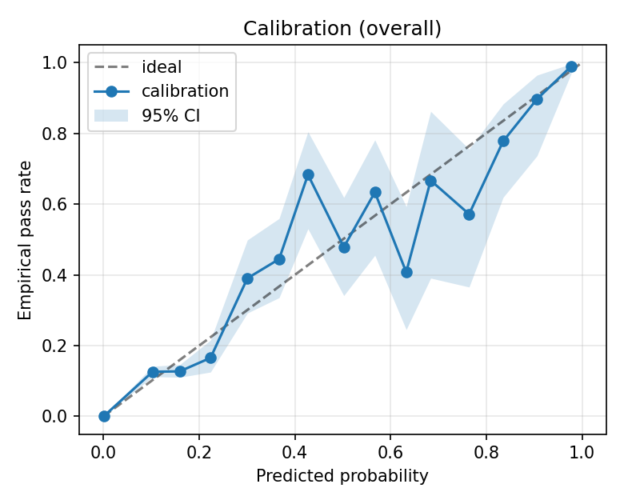
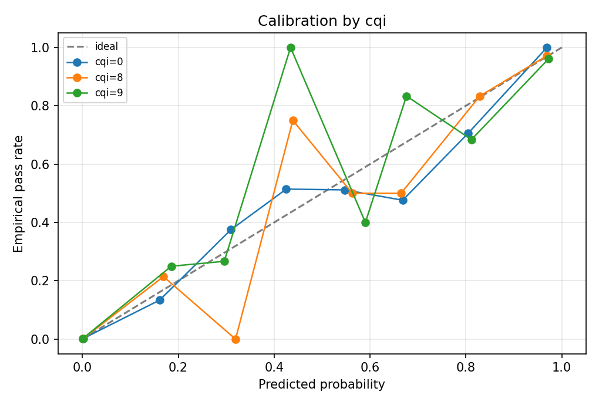
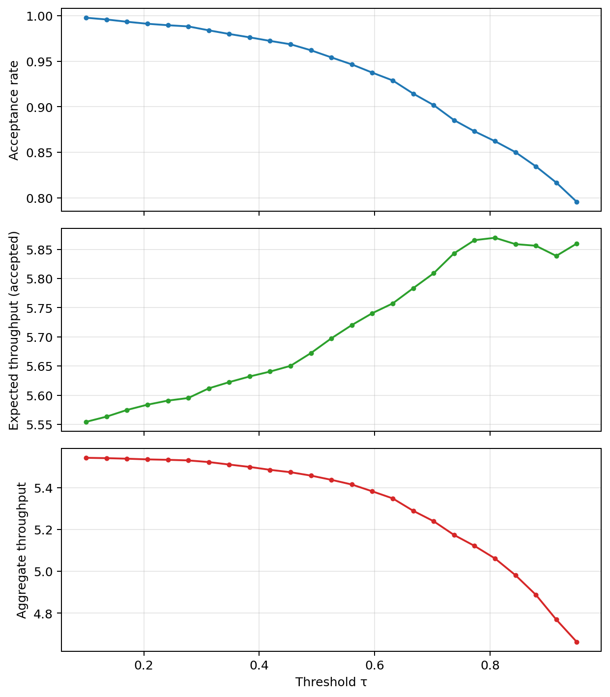
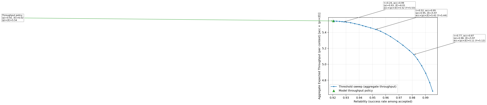

# Results Summary and Interpretations

This document links the main evaluation figures generated under `ML/reports/` and provides concise interpretations for each. Images are embedded directly for quick review.

## 1) Calibration (Overall)

- Data: `reports/calibration_overall.csv`
- Summary: The reliability curve closely tracks the diagonal across bins. The shaded 95% CI band indicates sampling uncertainty; larger bands in mid‑range bins reflect fewer predictions there. Expected Calibration Error (ECE) ≈ 0.0008 from `metrics_prob.json` shows excellent overall calibration.

Why mid‑range (≈0.4–0.7) looks “unstable”:
- Low bin mass: few predictions fall into equal‑width bins in this region, so empirical rates have higher variance (wide CI band).
- Tree discretization: boosted trees output a small number of leaf scores; probabilities therefore jump between discrete levels, exaggerating wiggles between adjacent bins.
- Boundary noise: contexts near the BLER decision boundary naturally produce mid‑range probabilities and more label noise.
- Slice concentration: if certain CQI/SNR slices dominate this region, small per‑slice biases concentrate there. Per‑slice calibration plots help confirm.

Takeaway: The CI band shows these deviations are largely explained by sampling variance, not a systematic thresholding issue. The training threshold τ only governs decision rules; it does not change probabilities.

### Calibration by CQI (Slice‑Aware)

- Data: `reports/metrics_by_cqi.csv`
- What it shows: Reliability curves drawn separately per CQI slice, each compared to the ideal diagonal. This checks whether probability calibration holds uniformly across operating regimes rather than averaging them together.
- Interpretation:
  - Curves that stay near the diagonal indicate slice‑wise calibration. Deviations confined to low‑count regions are often noise; use the counts in `metrics_by_cqi.csv` to judge stability.
  - If a slice is consistently above the diagonal (empirical pass rate > predicted), the model is conservative there; below the diagonal indicates optimism and a higher violation risk for that slice.
  - If specific CQI values show bias, consider per‑slice thresholding (different τ per CQI bin) or light post‑hoc calibration by slice. The overall ECE can still be low even when a small slice has drift — this view helps catch that.

## 2) Baseline vs Model Summary

- Data: `reports/baseline_summary.json`
- Summary: Model threshold and throughput policies achieve high expected throughput with moderate violation rates. Baseline CQI can perform competitively when using a calibrated CQI→MCS mapping with a small guardrail; naïve round(CQI) tends to collapse to MCS 0 in this dataset. OLLA requires a sensible initialization and step size to avoid getting stuck at very low MCS.

## 3) Policies vs Elevation

- BLER target window figures: 
  - 
  - 
  - 
- Data: corresponding CSVs (e.g., `reports/bler_vs_elevation_data_blerw2000.csv`)
- Summary: BLER decreases with elevation as expected; the model‑based policies select higher MCS at higher elevation. Differences between windows quantify the impact of averaging horizon on stability.

## 4) Feature Importance / SHAP (if available)

- SHAP outputs: `reports/shap_summary.csv`, `reports/shap_top_contribs.csv`
- Summary: Feature importance highlights SNR/CQI/pathloss as primary drivers. The SHAP files provide per-feature contribution magnitudes and per-row top contributors; use them to drill into specific slices or examples.

## 5) Violation Curves (ROC/PR)

- Data: `reports/violation_curves.json`
- Summary: Treating risk as 1 − P(pass) yields strong separation between failures and passes; curves illustrate detection performance for safeguarding policies.

## 6) Threshold Sweep and Throughput Pareto

- Data: `reports/threshold_sweep.csv` and `reports/throughput_pareto_data.csv` (if produced)

Richer interpretation of the three threshold‑sweep panels:
- Acceptance rate A(τ): fraction of contexts for which at least one candidate MCS has P(pass) ≥ τ and is selected by the “highest feasible MCS” policy. As τ increases, A(τ) falls because fewer contexts meet the reliability guardrail.
- Reliability among accepted R(τ): empirical mean P(pass) of the selected MCS on accepted contexts. In expectation, the violation rate among accepted is 1 − R(τ). Calibrating τ to a target violation level (e.g., 10%) means choosing τ so that 1 − R(τ) ≈ 0.10 on validation.
- Expected throughput on accepted Tacc(τ): mean of P(pass) × spectral_efficiency(selected MCS) over accepted contexts. This represents the expected bits per symbol when you actually transmit.
- Aggregate throughput Tagg(τ): A(τ) × Tacc(τ). This captures the global effect: higher τ yields safer but fewer transmissions, while lower τ increases acceptance but at lower expected per‑transmission throughput. The optimum is often a middle ground where Tagg(τ) peaks subject to reliability constraints.

How to choose τ in practice:
- Reliability first: pick the smallest τ such that 1 − R(τ) ≤ target_violation (e.g., 10%). This maximizes acceptance at the required reliability.
- Throughput subject to guardrail: among τ that satisfy the reliability target, pick the one that maximizes Tagg(τ). This balances link utilization and safety.
- Operations tip: monitor the realized violation online; adjust τ slightly over time to track the operational target as conditions drift.

Pareto plot context:
- The Pareto chart shows the frontier achieved by varying τ (expected throughput vs violation) and overlays the throughput‑optimal policy point (argmax P(pass) × efficiency without a guardrail). It makes the trade‑off explicit and helps validate the operating τ relative to the unconstrained optimum.

## Notes

- All figures are produced from the same trained model (`models/xgb_mcs_pass.json`). For reproducibility, seed and sample sizes are recorded in the script outputs.
